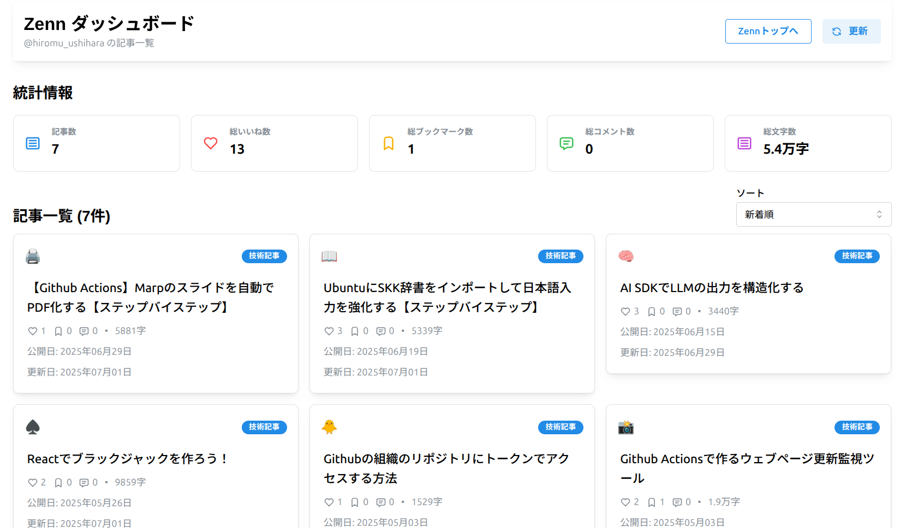

# Zennダッシュボード

このアプリケーションは，Zennのユーザー記事情報をAPI経由で取得し，統計情報や記事一覧を美しいUIでダッシュボード表示するVite+React+TypeScript製Webアプリです．

- いいね数・ブックマーク数・コメント数・文字数などを自動集計
- 記事一覧はソート（新着順・更新日順・いいね数順・ブックマーク数順）可能
- Mantine UIでモダンなデザイン
- Vercelサーバーレス関数でCORS問題も解決



## 利用方法
自身のZennアカウントの情報を取得して，ダッシュボード化するために利用可能です．

### ローカルでの利用方法

1. リポジトリをクローンします．
1. `.env`ファイルを作成して，
    ```bash
    VITE_ZENN_USER_NAME=your_user_name
    ```
    を記載します．
1. 依存環境をインストールします．
    ```bash
    npm install
    ```
1. 起動します．
    ```bash
    vercel dev
    ```

### Vercelでのデプロイ方法

Githubリポジトリを作成した上で，[Vercel](https://vercel.com/)にデプロイすればオンラインに公開することもできます．
デプロイの際に，環境変数として`VITE_ZENN_USER_NAME`を設定してください．


## 更新履歴
- Jul. 1, 2025
    - アプリケーションを作成
    - Vercelにデプロイ
- Jul. 2, 2025
    - UIを整え，Zennトップへのリンクを追加し，Zenn公式のページではないことを明記しました
- Jul. 3, 2025
    - 更新日順でのソート機能を追加しました
    - セキュリティに関する問題を解消しました
        - [参考](https://github.com/vercel/vercel/issues/13396#issuecomment-2956686632)に記載の通り，古いバージョンのコードでも実際の問題はありません
- Jul. 4, 2025
    - 技術記事とアイデアのチェックボックスを追加し，記事のフィルタリングを可能にしました
    - WebページのタイトルとファビコンをZennのユーザー情報に基づいて表示するように変更しました