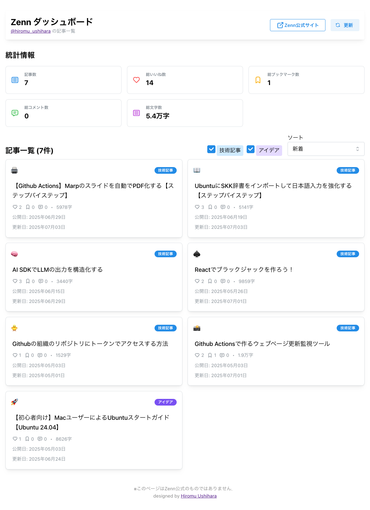

# Zennダッシュボード

このアプリケーションは、Zennのユーザー記事情報をAPI経由で取得し、統計情報や記事一覧を美しいUIでダッシュボード表示するReact + TypeScript製Webアプリです。

- いいね数・ブックマーク数・コメント数・文字数などを自動集計
- 記事一覧はソート（新着順・いいね順・ブックマーク順）可能
- Mantine UIでモダンなデザイン
- Vercelサーバーレス関数でCORS問題も解決

